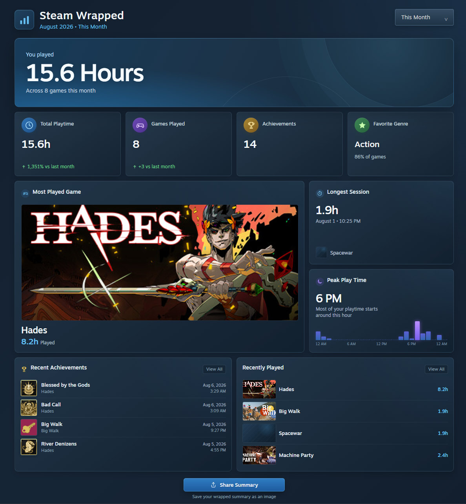
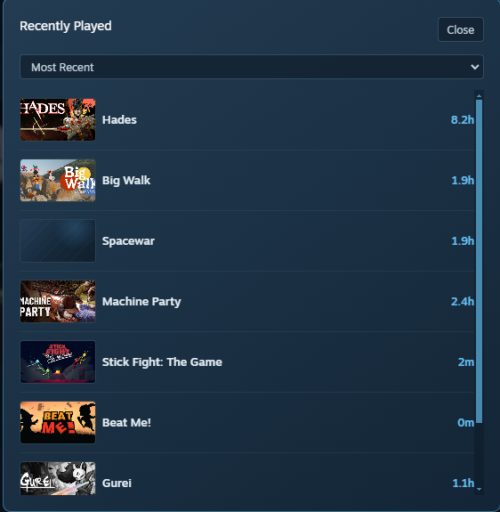
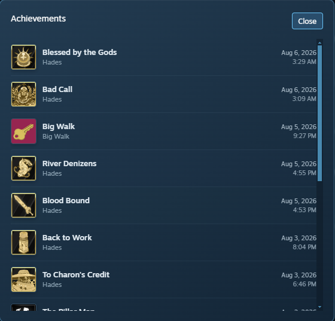

# Steam Wrapped

Steam Wrapped is a Millennium plugin that adds a native Steam-style gaming activity summary to the Steam client. It brings a dedicated Wrapped page into Steam without opening a separate application or browser.

## Preview

<table>
  <tr>
    <th colspan="2">Dashboard Overview</th>
  </tr>
  <tr>
    <td colspan="2" align="center">
      
    </td>
  </tr>
  <tr>
    <th>Recently Played</th>
    <th>Achievements</th>
  </tr>
  <tr>
    <td align="center">
      
    </td>
    <td align="center">
      
    </td>
  </tr>
</table>

## What it provides

- A Steam Wrapped entry in the Store navigation bar.
- A dashboard with selectable periods such as this month, last month, the last three months, this year, and custom ranges.
- Locally tracked game sessions with live playtime for the currently running game.
- Period-based totals for playtime, games played, achievements, and favorite genre.
- Gaming insights including most played game, longest session, peak play time, and a 24-hour activity histogram.
- Recent achievements and recently played games, with links back to their native Steam Library pages.
- A high-resolution Share Summary PNG export of the dashboard.

All dashboard values are calculated from the selected period and update when the period changes.

## Requirements

- Steam for Windows.
- [Millennium](https://steambrew.app/) installed in the Steam client.

## Installation

After the plugin is approved in the [Millennium Plugin Database](https://github.com/SteamClientHomebrew/PluginDatabase), install **Steam Wrapped** from Millennium's plugin manager and reload Steam WebUI when prompted.

For development, clone the repository into your Millennium plugins directory and build it with the commands below.

## Development

```powershell
bun install
bun run typecheck
bun run build
```

The plugin is a WebKit-only Millennium plugin (`useBackend: false`) and uses Steam's in-client WebUI APIs for navigation and metadata. Session history and cached records remain local to the plugin; no separate service is required.

## Project status

Steam Wrapped is actively being developed. The current release focuses on the native entry point, period-aware tracking, the summary dashboard, game and achievement navigation, recent activity, and image export. Additional Wrapped sections may be added over time.

## Contributing

Bug reports and improvements are welcome through GitHub issues and pull requests. Please include the Steam client version, Millennium version, plugin version, and a short reproduction path for UI or tracking issues.
